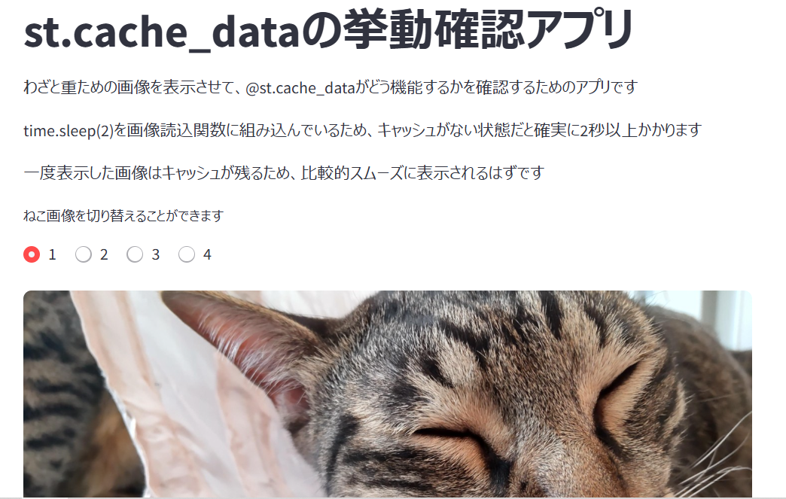

# Streamlit_cache_test
別のアプリをStreamlitでデプロイした際、必要以上にAPIキーを叩いてしまったので  
st.cache_dataを導入することにし、その動作確認として作ったアプリです。  
Streamlitで公開しています → ([リンク]())  

## スクリーンショット

  

## 技術スタック
- Python 3.12.6
- Streamlit 1.45.1

## 画像について
ねこ可愛いですよね。自分で撮影したものです。